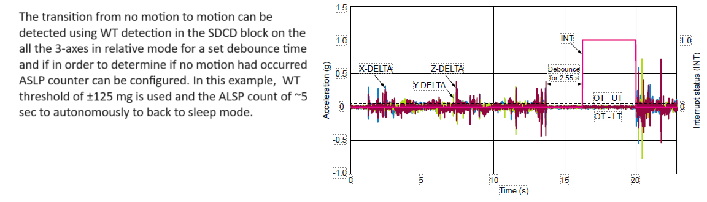
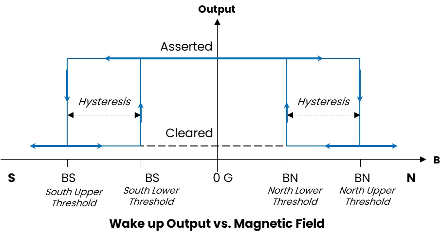
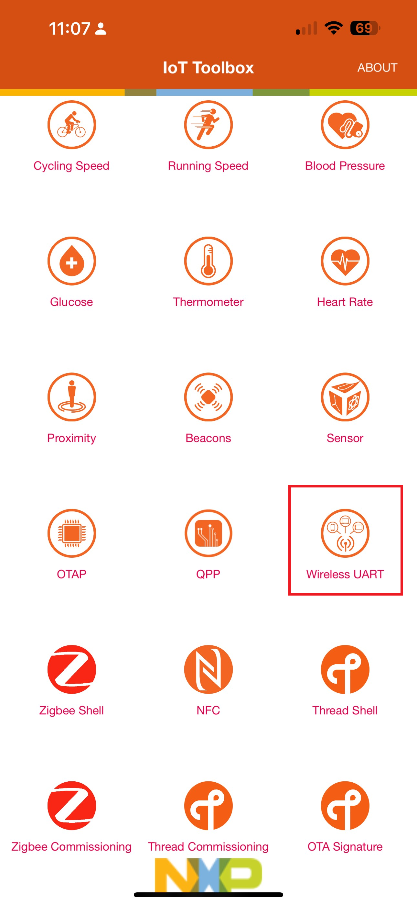
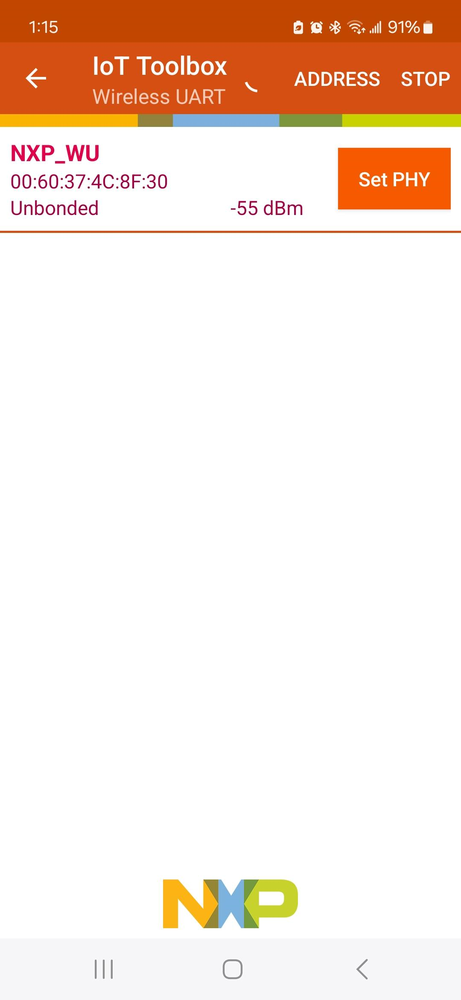
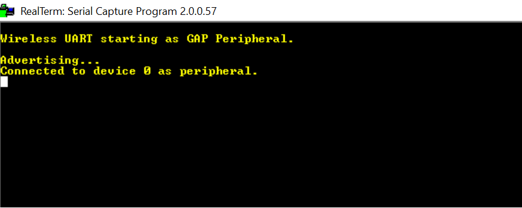
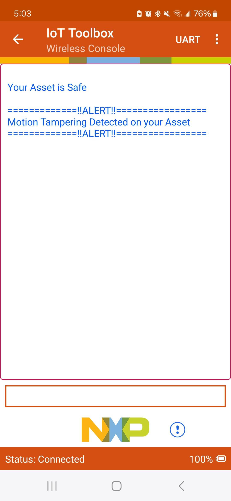
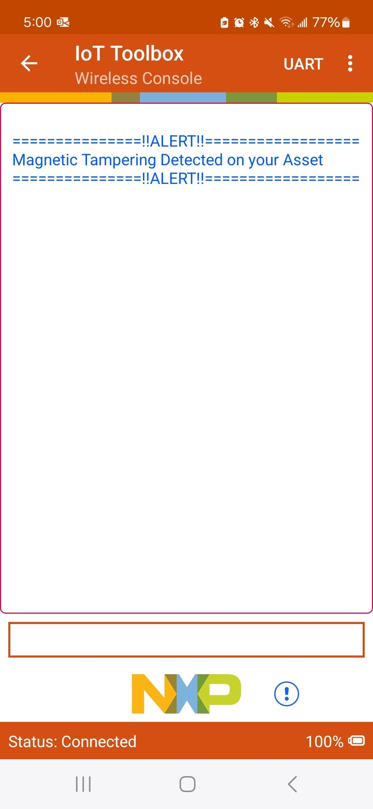

# NXP Application Code Hub

## Tamper detection with low-power wakeup sensor using BLE wireless UART

- This example use FRDM-MCXW71 and on-board FXLS8974CF accelerometer or NMH1000 magnetic switch using Hall Switch 3 click expansion board to demonstrate autonomous detection of tampering/theft/abuse on device using low-power motion or magnetic wakeup feature and trasmit ALERT message via BLE wireless UART.

- [FXLS8974CF](https://www.nxp.com/part/FXLS8974CF) is 3-axis accelerometer targeted for application requiring low-power motion wake up. This sensor has SDCD embedded block which implements an efficient and flexible inertial event detection function to detect various inertial events like no-motion/motion detecting tamper/theft/abuse on an asset. This ultra-low power wake-up on motion can trigger host MCU to wake-up or go back to deep sleep mode when no motion detected autonomously.  
  The image below shows SDCD block configuration to detection No-Motion to Motion:  
   

- [NMH1000](https://www.nxp.com/products/sensors/magnetic-sensors/nmh1000-ultra-low-power-and-low-voltage-magnetic-switch:NMH1000) is an ultra-low power monolithic Hall effect magnetic field sensor that triggers an output when surrounding magnetic field is greater than the user-defined detection threshold. The output pin is asserted or cleared upon the comparison of the magnetic field and selected thresholds. It can find lots of applications requiring change in magnetic field strength to wake-up and raise interrupt to wake-up host MCU/System.

  The image below shows Mag wakeup output and Hysteresis for NMH1000:  
   

- There are many applications where user would like to detect unwanted, intentional touch or damage/abuse or act of theft on their high value/secure assets at home and/or workplace environment. Implementing low-power wake-up sensors allows devices to continuously monitor for unauthorized access or tampering without consuming significant battery life. These sensors can be configured to detect physical disturbances, such as changes in the device’s enclosure or unauthorized opening
Target applications include:
  - Smart meters tampering,
  - Home security, Safebox/locker tampering
  - Personal medical device abuse, personal laptop/tablets tamper/theft
  - Warehouse theft detection, machine tampering,
  - Door open/close detection etc.

- As systems become more advanced and complex, the need for sophisticated security measures like tamper detection using wake-up sensors becomes increasingly important. These sensors offer a low-cost, low-power, proactive and effective solution for ensuring the integrity and safety of devices.

- This example demonstrates ease-of-enablement using NXP's FRDM-MCXW71/7x and low-power wakeup sensors (FXLS8974CF and NMH1000) development ecosystem to accelerate prototyping for your such applications.

> #### Boards: FRDM-MCXW71, FRDM-MCXW7X
> #### Accessories: On-Board Accelerometer FXLS8974CF, mikroe_hall_switch_3_click
> #### Categories: Low Power, Sensor, Wireless Connectivity
> #### Peripherals: I2C, UART
> #### Toolchains: MCUXpresso IDE

## Table of Contents
1. [Software](#step1)
2. [Hardware](#step2)
3. [Setup](#step3)  
3.1 [Hardware Setup](#step3.1) 
3.2 [Software Setup](#step3.2)
4. [Run Demo](#step4)
5. [Results](#step5)
6. [Support](#step6)

## 1. Software
- [IoT Sensing SDK (ISSDK) v1.8](https://nxp.com/iot-sensing-sdk) offered as middleware in MCUXpresso SDK for supported platforms
- MCUXpresso SDKv2.16.0 for FRDM-MCXW71 or newer
- [MCUXpresso IDE v11.10.0](https://www.nxp.com/design/design-center/software/development-software/mcuxpresso-software-and-tools-/mcuxpresso-integrated-development-environment-ide:MCUXpresso-IDE)
- Git v2.39.0
- [NXP IoT ToolBox App - Android Store](https://play.google.com/store/apps/details?id=com.freescale.kinetisbletoolbox&hl=en_US&pli=1) or
  [NXP IoT ToolBox App - Apple Store](https://apps.apple.com/us/app/iot-toolbox/id1362450908)

## 2. Hardware
- FRDM-MCXW71/7x MCU board with on-board FXLS8974CF accelerometer
- Hall Switch 3 Click expansion board for NMH1000 magnetic switch sensor
- Personal Computer
- Mini/micro C USB cable
- Android or Apple Mobile Phone supprting BLE wireless connectivity.

## 3. Setup

### 3.1 Hardware Setup

#### 3.1.1 Step 1: Flashing NBU
- Flash your FRDM-MCXW71 with its corresponding NBU for wireless examples. 
- The NBU file is available as part of downloaded ACH example under 
"dm-tamper-detection-using-low-power-wakeup-sensor-over-ble\tamper_detection_demo\\<project_name>\nbu" folder.
- Information regarding flashing NBU can be found on the getting started page for FRDM-MCXW71.

#### 3.1.2 Step 2: Connect to host computer
- Connect a micro USB cable from connector MCU-LINK to a host computer.
- For running tamper detection using NMH1000 magnetic switch sensor, connect Hall Switch 3 click board to FRDM-MCXW71 MCU board.

### 3.2 Software Setup

#### 3.2.1 Step 1: Download and Install required Software(s)
- Download & Install [MCUXpresso IDE v11.10.0 oe newer](https://www.nxp.com/design/design-center/software/development-software/mcuxpresso-software-and-tools-/mcuxpresso-integrated-development-environment-ide:MCUXpresso-IDE)
- Download and Install MCUXpresso SDKv2.16.0 or newer for FRDM-MCXW71
- Install Git v2.39.0 (for cloning and running west commands)
- Download and Install [NXP IoT ToolBox App - Android Store](https://play.google.com/store/apps/details?id=com.freescale.kinetisbletoolbox&hl=en_US&pli=1) or
  [NXP IoT ToolBox App - Apple Store](https://apps.apple.com/us/app/iot-toolbox/id1362450908)

#### 3.2.2 Step 2: Clone the APP-CODE-HUB/dm-tamper-detection-using-low-power-wakeup-sensor-over-ble
- Clone this repository to get the example projects:
- Change directory to cloned project folder: 
    cd *dm-tamper-detection-using-low-power-wakeup-sensor-over-ble*

#### 3.2.3 Step 3: Build example projects
- Open MCUXpresso IDE and select a directory to create your workspace.
- Install MCXUpresso SDK 2.16.0 for FRDM-MCXW71 (drag and drop SDK zip into "Installed SDK" view) into MCUXpresso IDE.
- Go to "Quickstart Panel" and click on "Import Project(s) from file system",
- Select "Project directory (unpacked)" and browse to the cloned project folder.
- Select example project ("frdmmcxw71_fxls8974_tamper_detect" or "frdmmcxw71_nmh1000_tamper_detect") that you want to open and run.
- Right click on project and select build to start building the project.

### 4 Run Demo

#### 4.1 Step 1: Flash the demo firmware on FRDM-MCXW71 board
- Connect a USB-C cable between the host PC and the MCU-Link USB port on the target FRDM-MCXW71 board.
- Choose the "frdmmcxw71_fxls8974_tamper_detect" or "frdmmcxw71_nmh1000_tamper_detect" project.
- Right click on the project and select "Debug As". Select MCUXpresso IDE LinkServer (inc. CMSIS DAP) probes.
- Debugger will start downloading the program to device. MCU-LINK probes will be identified. Click “OK” to continue.
- Click on “Resume” button or press “F8” key on your keyboard to continue running the downloaded program on device.
- Click on “Terminate” button or press “CNTR + F2” to terminate the debug session.
- Disconnect the USB-C cable connected to FRDM-MCXW71 and reconnect.

#### 4.2 Step 2: Start Advertising
- To enable your board to start its BLE advertising, press and release button SW3.

#### 4.3 Step 3: Connect to the IoT ToolBox App
- Open the installed NXP IoT Toolbox (available from Play Store and App Store) on your mobile phone. Make sure bluetooth connection is ON.
- Inside the application, click on the Wireless UART widget. Scan should start automatically.  
  
- When a device called NXP_WU appears, click on it. Your phone should now be connecting to the board.  
  

## 5. Results
- After connecting with the FRDM-MCXW71 device, the serial UART terminal will show this message:  
  
- With no tampering/motion shown on the FRDM-MCXW71 board, the Wireless UART application on IoT ToolBox mobile app will show status as: "Your Asset is Safe"
#### Tamper Detection using FXLS8974CF:
- When you show tampering/movement on the FRDM-MCXW71, the on-board FXLS8974CF accelerometer detects the motion and wakeup.
- At that point, you will see Wireless UART app showing ALERT message as shown below:  
  
- FRDM-MCXW71 board will also show "RED" LED status. The "RED" LED status will continously remain ON till tampering/motion detected.
- If there is no further tampering/motion detected for continous ~5 sec, the on-board FXLS8974CF accelerometer will detect no-motion and update the status message
  on wirless UART app. The "RED" LED status on FRDM-MCXW71 board will also go OFF.
#### Tamper Detection using NMH1000 magnetic switch:
- When you put a magnet near to the NMH1000 sensor to show tampering on the FRDM-MCXW71, NMH1000 detects change in magnetic field and wake-up.
- At that point, you will see Wireless UART app showing ALERT message as shown below:  
  
- FRDM-MCXW71 board will also show "RED" LED status. The "RED" LED status will continously remain ON till tampering/magnetic field change detected.

## 6. Support
- Reach out to NXP Sensors Community page for more support - [NXP Community](https://community.nxp.com/t5/forums/postpage/choose-node/true?_gl=1*fxvsn4*_ga*MTg2MDYwNjMzMy4xNzAyNDE4NzM0*_ga_WM5LE0KMSH*MTcwMjQxODczMy4xLjEuMTcwMjQxODczNi4wLjAuMA..)
- For more details on FXLS8974CF SDCD block, refer to the application note - [AN12004](https://www.nxp.com/docs/en/application-note/AN12004.pdf)
- Learn more about FXLS8974CF 3-axis accelerometer, refer to - [FXLS8974CF DS](https://www.nxp.com/docs/en/data-sheet/FXLS8974CF.pdf)
- Learn more about NMH1000 mangetic switch, refer to - [NMH1000 DS](https://www.nxp.com/docs/en/data-sheet/NMH1000.pdf)
- Accelerate your sensors development using Sensor ToolBox, refer to - [Sensors Development Ecosystem](https://www.nxp.com/design/design-center/software/sensor-toolbox:SENSOR-TOOLBOXX)

#### Project Metadata
<!----- Boards ----->
 

<!----- Categories ----->
  

<!----- Accessories ----->

<!----- Peripherals ----->
  

<!----- Toolchains ----->

Questions regarding the content/correctness of this example can be entered as Issues within this GitHub repository.

## 7. Release Notes
| Version | Description / Update                           | Date                        |
|:-------:|------------------------------------------------|----------------------------:|
| 1.0     | Initial release on Application Code Hub        | July 29th 2024 |